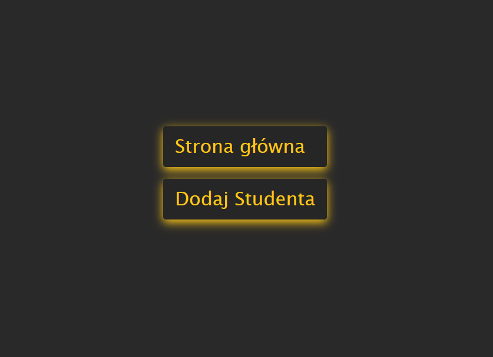
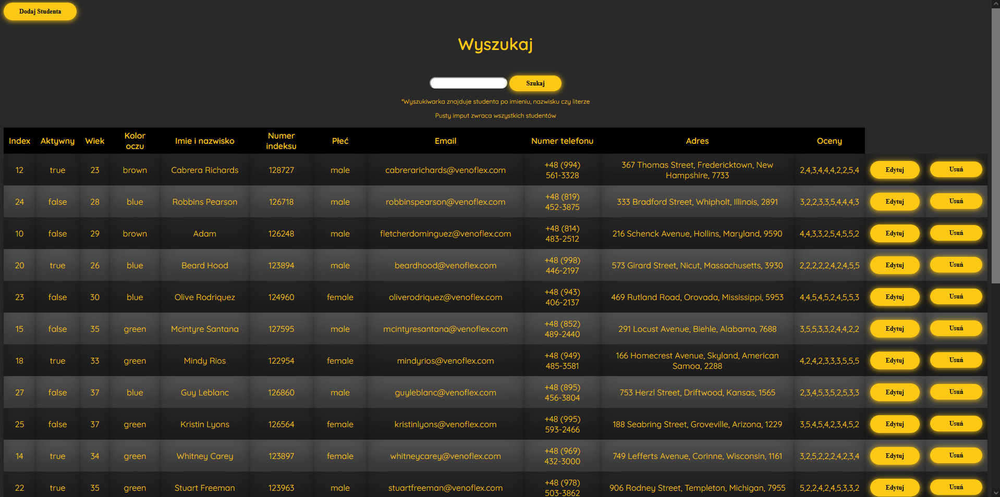
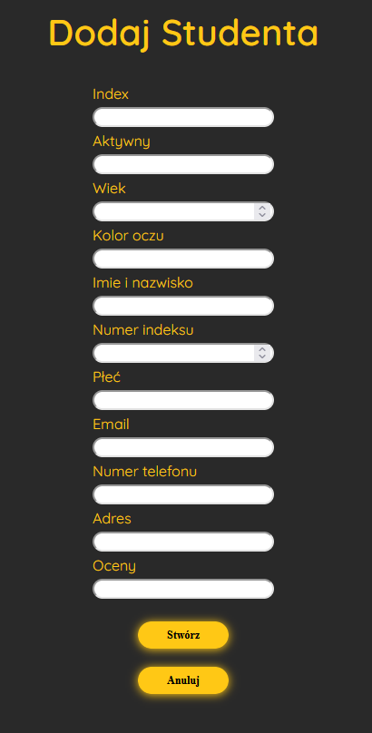

# Students Manager Page
This is application to manage students.

### How start
    1. Create database in https://www.mongodb.com/
    2. Set database "Students" and collection "Student"
    3. Add data (data.json)
    4. Add your link to URI in routes/students.js "mongodb+srv://<login>:<password>@students.n5vsa8d.mongodb.net/?retryWrites=true&w=majority";
    5. npm i
    6. npm run Start

### Screenshot

  
   
  
   
  

### Link
- Solution URL: [https://github.com/patryk468/StudentsManager]

### Built with
- HTML
- CSS
- JavaScript
- MongoDB
- Express.js

## Author
- Patryk O.

